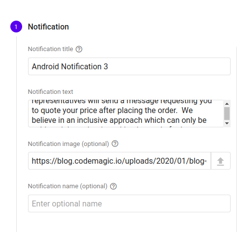
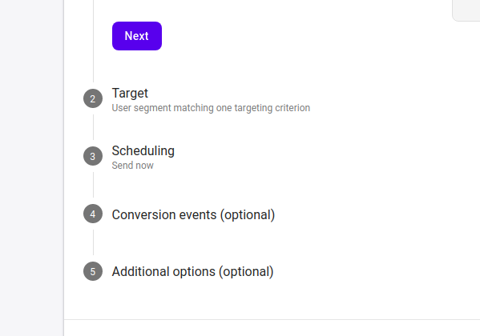
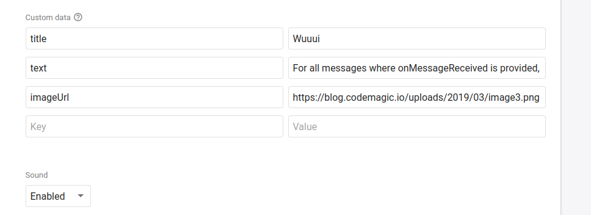

# writers-planx

## About

This app is generally designed to receive push notifications from FCM and aside from notifying the user, also display the related content when the app is launched.

### How to send messages to the app.

Messages/Notifications can be sent to the app in a number of custom formats and on pre-defined schedules by setting up the requirements on the Firebase web console.

##### Steps
1. Navigate to the Firebase Console for writers-planx project on https://console.firebase.google.com/u/0/project/writers-planx/notification. If you do not have permissions to access the resource, kindly send a request to the relevant authority. 
2. Navigate to the 'Cloud Messaging' link on the side-menu.
3. You will be presented with a console where you can configure your messages.
4. It is encourged to include an image with your notification content.
5. The notification will be propagated to _all_ devices either imediately or at the scheduled time.

### IMPORTANT

When constructing messages, fill out the required form in the main section:

Then move down to the custom section and make sure to fill out the 3 optional values with names exactly(case sensitive) as in the below screenshot (Each corresponds to the values input above and are required in order to preserve the notification if it is delivered while the app is in the background):
1. title 
2. text
3. imageUrl

Make sure the three fields are filled with the corresponding values provided in the first section.

